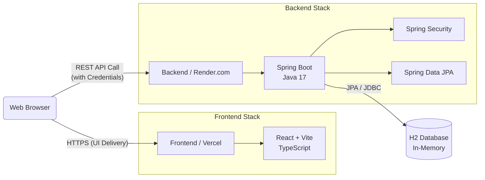
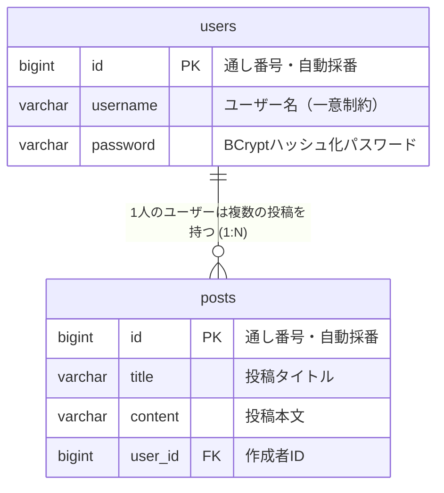

# 基本設計書 (Basic Design)

> [!NOTE]
> 本ドキュメントはアプリケーションの基本アーキテクチャ、画面設計、および大まかな機能構成を定義します。

## 1. システム構成・アーキテクチャ (System Architecture)

フロントエンドとバックエンドを完全に分離し、RESTful API通信を用いた構成を採用しています。

## 2. 画面一覧・画面遷移 (Front-End Views)

システム上の主要な画面は以下の4画面で構成されています。

| 画面名 | URLパス | 概要・対象ユーザー |
| :--- | :--- | :--- |
| **タイムライン画面** | `/` | 投稿一覧を表示するホームページ（全ユーザーアクセス可能） |
| **ログイン画面** | `/login` | 既存アカウントの認証を行う画面 |
| **ユーザー登録画面** | `/register` | 新規アカウントの登録を行う画面 |
| **新規投稿画面** | `/` (タイムラインに統合) | ログイン済みユーザーが投稿を行うための入力フォーム |

## 3. API一覧 (Backend Endpoints)

フロントエンドからのリクエストを受け付けるAPIエンドポイントです。

| エンドポイント | メソッド | 要認証 | 概要 |
| :--- | :--- | :---: | :--- |
| `/api/auth/register` | `POST` | 不要 | 新規ユーザー登録処理。成功時にメッセージを返却。 |
| `/api/auth/login` | `POST` | 不要 | ログイン処理。成功時にセッションクッキー（`JSESSIONID`）を発行。 |
| `/api/auth/me` | `GET` | 必須 | 現在のセッションのログインユーザー情報を取得。 |
| `/api/posts` | `GET` | 不要 | 登録されているすべての投稿情報（投稿者情報含む）をリストで取得。 |
| `/api/posts` | `POST` | 必須 | セッションユーザーを送信者として、新たな投稿（タイトル、本文）を作成。 |

## 4. データモデル (ER図)

インメモリデータベースで管理される主要なエンティティ間の関係図です。

## 5. セキュリティ・認証基本方針

> [!IMPORTANT]
> - フルスタック環境においてCookie経由のセッション情報を保持するため、フロントエンド（Axios等）にて `withCredentials: true` を設定する。
> - バックエンド（Spring Security）では、許可されたフロントエンドOrigin（Vercel等のURL）に対するCORSポリシーのホワイトリスト化を実施する。
